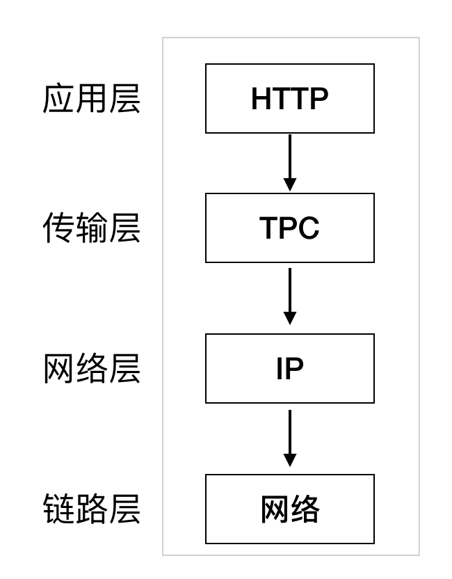

# 前端全链路优化-浅解析
谈起前端优化，这个面试必备提题目，每个前端都应该有点自己的小见解。说实话，对于这个课题，面对面试自己还是能侃侃而谈的说一两点自己的见解，可是真当把这个前端优化系统到前端全链路优化的层次，一时之间就不知道该从何入手。

在硬的骨头慢慢啃也能嘬出点汁来不是。身为前端道路上的小菜鸟，面对这块骨头，只能先找个头开始慢慢的探索，所以暂且停留在浅解析的阶段，不知道我从这块骨头上嘬出点汁合不合大家的胃口，还请各个路过的同胞们多提出一些见解。

## TCP/IP的通信传输流

既然是全链路优化，首先得了解什么是全链路。所谓的全链路也就是 从我们输入URL到看到页面的一个过程，也就是经过了一个TCP/IP的通信传输流。

上图为一个TCP/IP的通信传输流。

### 应用层

应用层决定了向用户提供应用服务时的通信活动。预存了各类通用的应用服务，比如FTP（文件传输协议）,DNS（域名系统）,HTTP协议。

### 传输层

传输层对于应用层，提供处于网络连接中两台计算机之间的数据传输。在传输层有两个不同的协议：TCP（传输控制协议）,UDP（用户数据报协议）

### 网络层

用来处理网络上流动的数据包。该层规定了通过怎么样的路径到达对方的计算机，并把数据包传给对方。

### 链路层

用来处理链接网络的硬件部分。

## 输入URL到页面加载的过程

* DNS解析
* TCP连接
* 发送HTTP请求
* 服务器处理请求并返回HTTP报文
* 浏览器解析渲染页面
* 连接结束

## 每个流程的详细过程已经具体优化
### 1. DNS解析
  网络通讯大部分是基于TCP/IP的，而TCP/IP是基于IP地址的，所以计算机在网络上进行通讯时只能识别如“202.96.134.133”之类的IP地址，而不能认识域名，DNS主要负责域名的解析，通过我们在浏览器地址中输入的域名，如：www.baidu.com返回相对应的IP地址。
    ① 用户主机上运行着DNS的客户端，就是我们的PC机或者手机客户端运行着DNS客户端了
    ② 浏览器将接收到的url中抽取出域名字段，就是访问的主机名，比如http://www.baidu.com/ , 并将这个主机名传送给DNS应用的客户端
    ③ DNS客户机端向DNS服务器端发送一份查询报文，报文中包含着要访问的主机名字段（中间包括一些列缓存查询以及分布式DNS集群的工作）
    ④ 该DNS客户机最终会收到一份回答报文，其中包含有该主机名对应的IP地址，DNS客户机得到IP地址并把它缓存到本地，供下次查询使用
    ⑤ 一旦该浏览器收到来自DNS的IP地址，就可以向该IP地址定位的HTTP服务器发起TCP连接
    
** DNS解析优化 **
  我们可以看到，每次进行一次DNS解析，都需要经过以上的几个步骤，如果每次都经过这几个步骤，会不会太耗时间？如何减少在DNS解析中消耗的时间呢？步骤中也提到了，也就是DNS缓存。
  在移动端避免DNS解析，一次域名到IP的映射需要几百毫秒的时间，并且存在DNS劫持的风险，建议使用IP直连代替域名访问。

### 2.TCP连接
  完成DNS解析解析以后，会通过三次握手进行TCP连接
### 3.发送HTTP请求
    发送HTTP请求的过程就是构建HTTP请求报文并通过TCP协议中发送到服务器指定端口(HTTP协议80/8080, HTTPS协议443)。HTTP请求报文是由三部分组成: 请求行, 请求报头和请求正文。
** 发送HTTP请求优化 **
  客户端每次向服务端发送一次http请求都需要消耗一定的时间。在这个层面上的优化，我们可以减少http请求的次数。
  * 使用雪碧图
  * 进行数据的打包，减少文件数量
  * 文件按需加载，减少同时请求多个文件
  * 数据异步加载
  * 图片的延迟加载
  * 利用数据缓存，减少发送http请求的次数
  

### 4.服务器处理请求并返回HTTP报文
 服务器端从在固定的端口接收到TCP报文，它会对TCP连接进行处理，对HTTP协议进行解析，并按照报文格式进一步封装成HTTP Request对象，并将HTTP报文返回给前端。
  HTTP响应报文也是由三部分组成: 状态码, 响应报头和响应报文。

状态码是由3位数组成，第一个数字定义了响应的类别，且有五种可能取值:

  * 1xx：指示信息–表示请求已接收，继续处理。
  * 2xx：成功–表示请求已被成功接收、理解、接受。
  * 3xx：重定向–要完成请求必须进行更进一步的操作。
  * 4xx：客户端错误–请求有语法错误或请求无法实现。
  * 5xx：服务器端错误–服务器未能实现合法的请求。
  
  重定向：将一个URL重新路由到另一个URL。重定向功能是通过301和302这两个HTTP状态码完成的。浏览器自动重定向请求到Location指定的URL上，重定向的主要问题是降低了用户体验。所以应该尽量避免重定向，提高用户的体验。

### 5.浏览器解析渲染页面
浏览器接受到HTML,CSS,JS文件后，回通过DOM数，进行页面的渲染。首先浏览器解析HTML文件构建DOM树，然后解析CSS文件构建渲染树，等到渲染树构建完成后，浏览器开始布局渲染树并将其绘制到屏幕上。在这个过程中我们可以进行以下的优化。

* 将css放在页面头部，如果将css放到html 的后面然后进行加载，会导致html加载完成但没有样式，导致页面样式错乱的存在。
* 将js放到html与css之后加载。
     * 这是由于js是单线程运行的，如果把js放到html之前，必然会阻塞后续的html的加载。
     * 另外由于有时候js依赖于部分html的dom数据，如果js提前加载会导致无法找到当前的dom数据，从而导致出错。
     * 有时候js依赖于部分css样式，如果js提前加载，然后再重新加载js的话，必然会造成js的重绘重排。
* 在浏览器端的渲染过程，如大型框架，vue和react它的模板其实都是在浏览器端进行渲染的，不是直接的html，而是要走框架中相关的框架代码才能去渲染出页面，这个渲染过程对于首屏就有较大的损耗，这个是不利于前端性能的☞业界就会有相关框架的服务端渲染方案，在服务端进行整个html的渲染，从而将整个html直出到我们的浏览器端，而非在浏览器端进行渲染。--在渲染之前，可做一些服务端渲染以及渲染优化的方案。
* js代码层面的优化
  * 减少获取dom的次数，使用dom元素需要把dom存储起来
  * dom的层级不要嵌套太深
  * 减少页面总闭包的使用，及时清理不用的定时器，以免造成不必要的内存泄漏
  * 删除多余代码
  * 合并重复代码提高代码的复用率
  * 使用轻量级的框架，不要大量使用框架

以上就我目前阶段对于前端全链路优化的一些简单理解，可能网络层面的理解相对欠缺，尤其是tcp链接层面的优化。后续还会继续深入的研究，持续更新。

